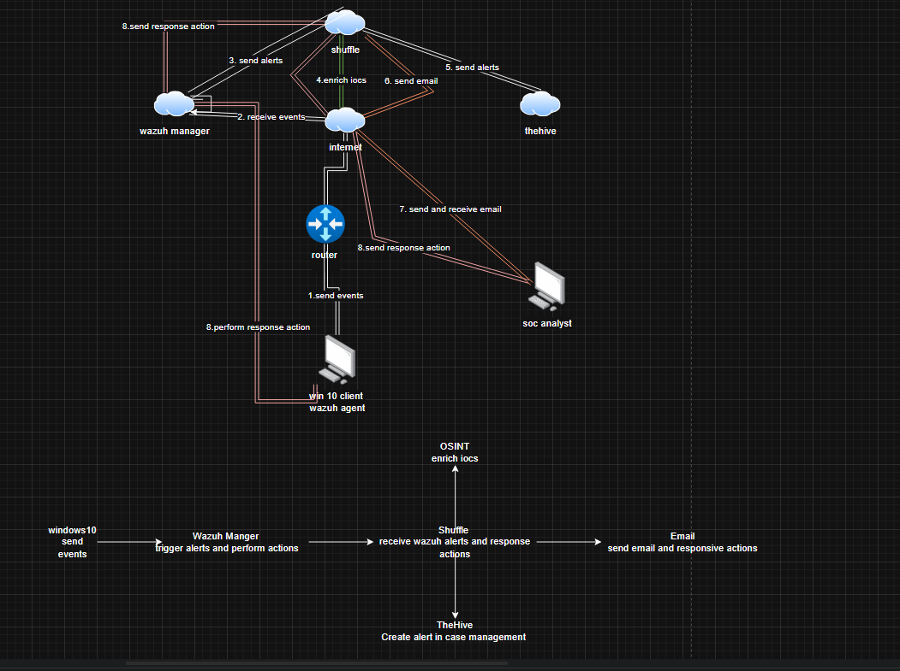

# soc-automation-lab
# 🔐 SOC Automation Lab: Wazuh + Shuffle + TheHive

## 📌 Overview

This project demonstrates an end-to-end SOC automation pipeline that detects threats (Mimikatz), triggers automated workflows, and creates incident cases.

## 🧱 Architecture

* SIEM: Wazuh
* SOAR: Shuffle
* Case Management: TheHive

## 🔄 Workflow

1. Wazuh detects Mimikatz activity
2. Alert is sent via webhook to Shuffle
3. Shuffle processes alert
4. Case is created in TheHive

## 🏗️ Architecture Diagram

## ⚙️ Technologies Used

* Wazuh
* Shuffle SOAR
* TheHive
* Elasticsearch
* Ubuntu Server

## 🚨 Use Case: Mimikatz Detection

* Detect credential dumping activity
* Automate alert triage
* Generate incident cases

## 📸 Screenshots

### Shuffle Workflow

### TheHive Case

### Wazuh Alert

## 🛠️ Setup Guide

See: docs/setup-guide.md

## 📂 Config Files

* configs/wazuh-ossec.conf
* configs/elasticsearch.yml
* configs/thehive-application.conf

## 🚀 Future Improvements

* Add Cortex analyzers
* Integrate VirusTotal
* Add Slack notifications

## 👤 Author

Keondre Burks
